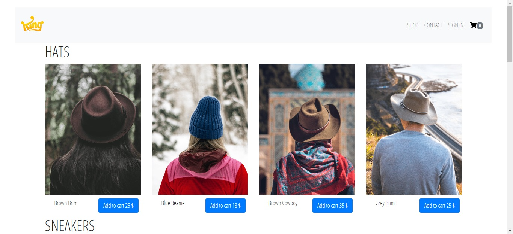

# Getting Started with Create React App

This project was bootstrapped with [Create React App](https://github.com/facebook/create-react-app).
It uses Firebase for the backend and authentification system and Stripe for the payment system

## Available Scripts

In the project directory, you can run:

### `npm start`

Runs the app in the development mode.\
Open [http://localhost:3000](http://localhost:3000) to view it in the browser.

The page will reload if you make edits.\
You will also see any lint errors in the console.

## Preview 

## Information

this project is based on the udemy [complete-react-developer-2019](https://www.udemy.com/course/complete-react-developer-zero-to-mastery/)
